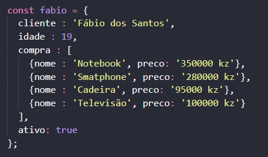
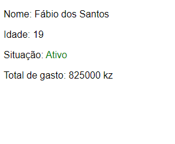
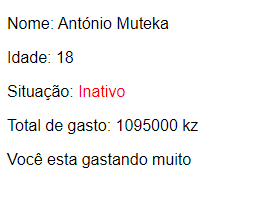

# Exerciocio 1 
     Crie 2 (ou mais) entidades (objectos)  que contenha : nome, idade, compra , ativo.
    
   Ex:
   

	
   

Onde :
   <ul>
	<li>E mostre : O nome , a idade , a situação, o total gastado;</li>
	<li>Pinte o estado de verde se estiver ativo e vermelho se entiver inativo;</li>
	<li>Caso os gastos for maior que 1.000.000 kz, apresente a seguinte messaguem : 'Você esta gastando muito'.</li>
    </ul>
	   
<h2>Resultado : </h2>
 

	
	
   

